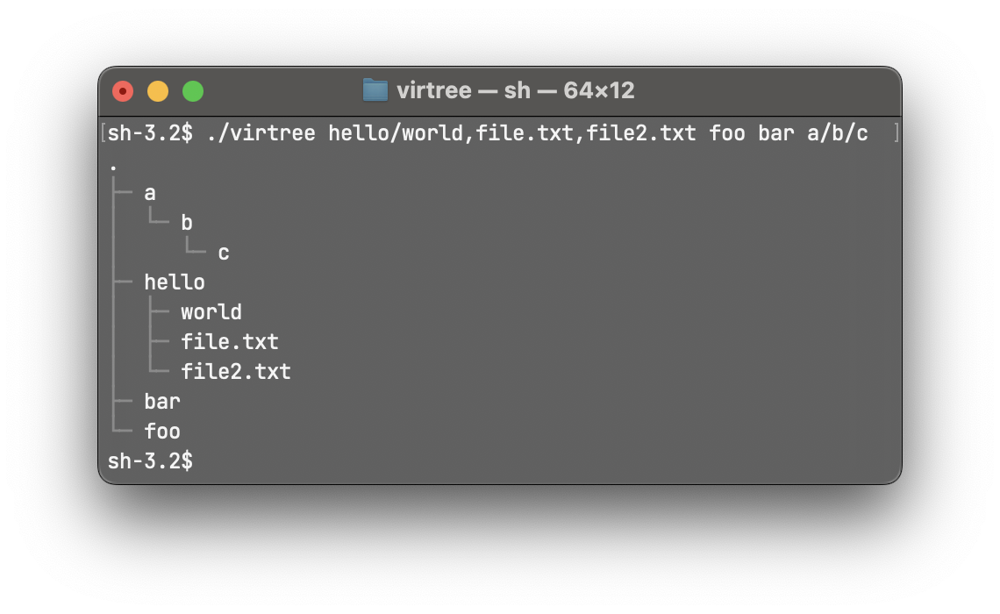

## `virtree`:
# Virtual directory tree prototyping
#### (🚨 Extremely niche project alert...)

Virtree is a command-line program for creating virtual file systems on the fly and outputting an ASCII directory tree representation.

The output is inspired by the `tree` command on many operating systems. 



## Coming Soon

Currently, `virtree` works with command line arguments only. A 'builder' mode is coming soon with an interactive shell and user interface to allow dynamic inputs which update in real time. This mode will be more useful for more complex prototyping. 

## Usage (command-line)

To get started, provide some virtual paths on the command-line. These paths will be stored virtually in memory, not on your actual OS. 

```virtree hello/world/a.txt b.txt hello/c.txt```

Output:
```
.
├─ b.txt
└─ hello
   ├─ c.txt
   └─ world
      └─ a.txt
```
Multiple files or folders in the same directory are declared using comma separated values. This is only supported at the end of the path:

```virtree hello/world/a.txt,b.txt,c.txt```

Output:
```
.
└─ hello
   └─ world
      ├─ a.txt
      ├─ b.txt
      └─ c.txt
```
> Note: To escape commas, use a double comma (`,,`). 

## Usage (builder mode)
Coming soon...

## Flags 
- `--include`: Include the contents of the current directory in the virtual file system. Running virtree with just the include flag will have a similar output to running the `tree` command with no arguments. 